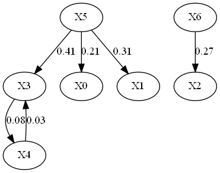

# Summary

Causal analysis, a fundamental problem in various disciplines, has recently been recognized
as a promising approach to developing an explainable deep learning. However, incorporation 
of causality into artificial intelligence algorithms is faced with challenges such as 
ambiguity, non-quantitativeness, and computational inefficiency in traditional formalisms.
Over the past two decades, these challenges have been essentially fixed, with the development
of a rigorous and quantitative causality analysis - the Liang-Kleeman information flow theory
`[@liang_and_kleeman_2005; @liang_2008; @liang_2014; @liang_2016; @liang_2021]`. This theory, 
which is based on a rigorous footing and derived from first principles, has resulted in closed-form \
and rather concise formula. Applications of it have led to many scientific discoveries in fields 
ranging from finance, neuroscience, quantum mechanics, artificial intelligence to oceanography, 
meteorology and climate science. This package provides a practical implementation of the 
theory, complete with core codes (in Python, R, and Matlab) and selected examples. The 
corresponding causality estimation programs are designed to have simple and easy-to-use 
interfaces.

# Background
Causal inference is fundamental problem in scientific research Particularly in recent years,
the rapid development in artificial intelligence (AI) has sparked significant interest, partly 
due to the belief that it may help take AI towards a level approaching human intelligence
`[@pearl_theoretical_2018; @bengio_meta-transfer_2019]`. Existing works usually treat it as a 
problem in statistics or engineering; its mathematical formalization is a relatively recent
advancement `[@pearl_causality_2009; @jonas_elements_2018]`.

On the other hand, it has been realized that causality is actually “a real physical notion 
that can be derived ab initio” `[@liang_2016]`. It has been strictly deduced from first 
principles `[@liang_2016]` and thus can be quantified. The , which has been referred to as liang 
information flow (e.g., `@hristopulos_2024`), or Liang-Kleeman information flow (e.g., `@vannitsem_2019`); 
hereafter LKIF for short. This is the first formalism established on a rigorous basis within
the framework of dynamical systems. It yields analytical solutions in closed form, allowing
for easy quantification and normalization of causality between dynamic events. Since its 
advent, it has been validated with many benchmark systems such as baker transformation, 
Hénon map, Kaplan-Yorke map, Rössler system, etc. `[@liang_2016]`. Moreoever, it has been widely
applied in various disciplines such as climate science `[@stips_2016; @tao_relative_2021; 
@docquier_causal_2022]`, earth science `[@vannitsem_2019]`, economics `[@lu_break_2020]`, 
neuroscience `[@hristopulos_disrupted_2019; @cong_altered_2023]`, quantum physics `[@yi_quantum_2022]`,
to name but a few. Recently, it has gradually been applied in the AI area `[@song_improved_2019;
@rong_information_2022;@tyrovolas_information_2023]`, in the hope of building explanable AI algorithms.


# Statement of need

In early years, the Liang information flow analysis was open sourced in fragmented Matlab 
programs (available at http://www.ncoads.org). Considering the increasingly widespread application
of this method in various fields, it is necessary to organize the previous work into a unified
library. To this end, we have developed a package `LKIF`, in different languages such as `Python`,
`R`, as well as `Matlab`, to encompass the majority of the preliminary work related to 
the Liang information flow (https://github.com/YinengRong/LKIF). Readers can use this toolkit to 
achieve: 
1. Bivariate causality analysis `[@liang_2014]`;
2. Multivariable causality analysis `[@liang_2021]`;
3. Causal inference between different subsystems `[@liang_2022]`;
4. Causal inference with panel data, discontinuous time series or ensemble data `[@rong_panel_2021]`;
5. Time varying causality analysis;

…

The LKIF library provides a simple interface for estimating causality in a quantitative way under
the standards of numpy and scipy libraries. Additionally, it offers an extra interface for plotting
 the corresponding causal structure. To facilitate the understanding and application of this package,
 we have curated a comprehensive set of demonstrations, aimed at guiding readers through its usage.

# Mathematics

Lying at the center of this method is the formula for the multivariable causality, which has been been summarized
in a very brief way in `@liang_quantitative_2023`. The following material in this section is an exerpt from therein.  
“Consider a d-dimensional continuous-time stochastic system (systems with discrete-time mappings also available;
see `@liang_2016`: 


$$
 \frac{d\mathbf{X}}{dt} = \mathbf{F}(\mathbf{X},t) + \mathbf{B}(\mathbf{X},t) \dot{\mathbf{W}}  \quad \text{(1)} 
$$

where 
$\mathbf{X}=(\mathbf{X_1},\mathbf{X_2},...,\mathbf{X_d})^T$ 
is a d-dimensional vector of state variables, where
$\mathbf{F}=(\mathbf{F_1},\mathbf{F_2},...,\mathbf{F_d})^T$ 
may be arbitrary nonlinear functions of $\mathbf{X}$ and $t$,  $\dot{\mathbf{W}\ }$ is a vector of
white noise, and $\mathbf{B}\ =\ (b_{ij}\ )\$ is the matrix of stochastic perturbation amplitudes. 
Here $\mathbf{F}$ and $\mathbf{B}$ are both assumed to be differentiable with respect to $\mathbf{X}$
and $t$. For deterministic systems such as those in meteorology and oceanography, $\mathbf{B}$ is zero. 
`@liang_and_kleeman_2005` defined the rate of information flow/information transfer, or simply information
flow, from a component $X_j$ to another component $X_i$, as the contribution of entropy from $X_j$ per
unit time in increasing the marginal entropy of $X_i$. Hereafter by “entropy” we mean Shannon entropy, 
although other types of entropy have also been explored, such as Kullback –Leiber divergence `[@liang_causation_2018]`,
Von Neumann entropy `[@yi_quantum_2022]`, etc. `@liang_2016` proved that the rate of information flowing
from $X_j$ to $X_i$ (in nats per unit time), denoted $T_{j\rightarrow i}$, is

$$
T_{j\to i}=-E\( 
\frac{1}{\rho_i} 
\int_{\mathbb{R}^{d-2}}\frac{\partial F_iρ_{j⃥}}{\partial x_{i}} dx_{i⃥j⃥}
\)+
\frac{1}{2}E\( \frac{1}{\rho_i} \int_{\mathbb{R}^{d-2}}\frac{\partial^2 g_{ii}ρ_{j⃥}}{\partial x_{i}^2} dx_{i⃥j⃥} \)
\quad \text{(2)}
$$


where $dx_{i⃥j⃥}$ signifies $dx_1dx_2\ldots dx_{i-1}dx_{i+1}\ldots dx_{j-1}dx_{j+1}\ldots dx_d$ 
, $E$ stands for mathematical expectation, $g_{ii}={\sum} \_{k=1}^d b_{ik}^2$
, $\rho_i=\rho_i\(x_i\)$ 
is the marginal probability density function (pdf) of $𝑋_𝑖$, and $ρ_{j⃥}=\int_{\mathbb{R}^{d-2}}𝜌\(𝐱\)d\mathbf{x}_{j⃥} $.

Equation (2) has a nice property, which forms the basis of the information flow-based causality analysis `[@liang_2008]`, 
and has been referred to as “principle of nil causality.” It reads that

*If the evolution of* $X_i$ *does not depend on* $X_j$ *, then* $T_{j\rightarrow i}=0$.

Based on this property, the algorithm for the information flow-based causal inference is as follows: If $T_{j\rightarrow i}=0$,
then $X_j$ not causal to $X_i$; otherwise it is causal, and the absolute value measures the magnitude of the causality from $X_j$ to $X_i$. 

Another property regards the invariance upon coordinate transformation, indicating that the obtained information flow is an 
intrinsic property in nature; see `@liang_causation_2018`. As shown in `@liang_2021` (and other publications), this is very important in
causal graph reconstruction. It together with the principle of nil causality makes it promising toward a solution of the problem of latent confounding. 

For linear systems, i.e., when $\mathbf{F}(\mathbf{X})\ =\ \mathbf{f}\ +\ \mathbf{AX}$, and when $\mathbf{B}$ is constant, then 

$$
T_{j\rightarrow i}=a_{ij}\frac{\sigma_{ij}}{\sigma_{ii}},  \quad \text{(3)}
$$

where $a_{ij}$ is the ${(i,\ j)}^{th}$ entry of $\mathbf{A}$ and $\sigma_{ij}$ the population covariance between $X_i$ and $X_j$. Notice if $X_i$ and $X_j$
are not correlated, then $\sigma_{ij}=0$, which yields a zero causality: $T_{j\to i}= 0$. But conversely it is not true.
We hence have the following corollary:

*In the linear sense, causation implies correlation, but not vice versa.*

In an explicit formmula, this corollary expresses the long-standing debate on causation vs. correlation ever since `@berkeley_treatise_1710`. 

In the case with only $d$ time series $X_1,X_2,...,X_d$, under the assumption of a linear model with additive and independent noises, 
the maximum likelihood estimator (MLE) of (2) for $T_{2\rightarrow1}$ is:

$$
{\hat{T}}_{2\to 1} = \frac{1}{\text{det} \mathbf{C}} \cdot{\sum} _{j=1}^{d} {\Delta} \_{2j} C _{j,d1}
\cdot \frac{C _{12}}{C _{11}}, \quad \text{(4)}
$$

where $C_{ij}$ is the sample covariance between $X_i$ and $X_j$, $∆_{ij}$ the cofactors of the matrix $\mathbf{C}=C_{ij}$, and $C_{i,dj}$ the sample covariance 
between $X_i$ and a series derived from $X_j$: ${\dot{X}} _{j,n} \ =(X _{j,n+k}\ -X _{j,n})/(k∆t)$, with $k\geq1$ some integer.

Eq. (4) is rather concise in form, involving only the common statistics, i.e., sample covariances. The transparent formula makes causality analysis, which 
otherwise would be complicated, very easy and computationally efficient. Note, however, that Eq. (4) cannot replace (2); it is just an estimator (MLE) of the
latter. One needs to test the statistical significance before making a causal inference based on the estimator ${\hat{T}} _ {2 \to 1}$.
If what are given are not time series, but independent, identically distributed (i.i.d.) panel data, it has been shown that ${\hat{T}}_{2\to 1}$ has the same
form as (4); see `@rong_panel_2021`. 

Besides the information flow between two components, say $X_1$ and $X_2$, it is also possible to estimate the influence of one component, say $X_1$, on 
itself. Following the convention since `@liang_and_kleeman_2005`, write it as $\frac{dH_1^\ast}{dt}$. Then its MLE is

$$
\frac{d\widehat{H}_ 1^*} {dt}=\frac{1}{\det\mathbf{C}}\cdot\sum_{j=1}^d\Delta_{1j}C_{j,d1}  \quad \text{(5)}
$$

This result, first obtained in `@liang_2014`, provides an efficient approach to identifying self loops in a causal graph, which has been a challenging issue. 

If what we want to know is the causal relation between two subsystems/subnetworks, rather than two individual components/nodes, the information flow can also be
derived, in a way as above, and estimated in the maximum likelihood sense. The results are referred to `@liang_2022`.

Statistical significance tests can be performed for the estimators. This is done with the aid of a Fisher information matrix. See `@liang_2014` and `@liang_2021`
for details.

Causality in this sense can be normalized in order to reveal the relative importance of a causal relation. See `@liang_2015` for details. ”

# Demostration on how to use LKIF
The core program is that for the estimation of multivariate causality. It has been designed to be easy to use. For example, in calling the `Matlab` function 
`multi_causality_est`, one just needs to prepare a matrix $X$ of $n$ columns, each column being a series representative of the designated variable, and then 
essentially all the causal relations are obtained. In an old version when only the causality from $x_2$ to $x_1$ is considered, i.e., the following function call

```matlab
[T21, err90, err95, err99] = multi_causality_est(X, 1)
```
will result in T21, i.e., the causality from x2 to x1, and the confidence intervals at confidence levels of 90%, 95%, and 99%, respectively.

To demonstrate, let us reconsider the example in `@liang_2021`. This is a six-variable autoregressive (AR) model that incorporates various causal structures:


$$
\begin{cases}
x_{0}(t+1)&=-0.6x_{2}(t)+e_{0}(t)+\alpha_{0},\\
x_{1}(t+1)&=-0.5x_{0}(t)+0.8x_{5}(t)+e_{1}(t)+\alpha_{1},\\
x_{2}(t+1)&=0.7x_{1}(t)+e_{2}(t)+\alpha_{2},\\
x_{3}(t+1)&=0.7x_{3}(t)+0.4x_{4}(t)+e_{3}(t)+\alpha_{3},        \qquad \text{(6)}    \\
x_{4}(t+1)&=0.2x_{3}(t)+e_{4}(t)+\alpha_{4},\\
x_{5}(t+1)&=-0.5x_{5}(t)+e_{5}(t)+\alpha_{5}.
\end{cases}
$$

Here, the errors $e_i\sim N(0,\ 1)$ are independent, constant $\alpha=[0.1\ 0.7\ 0.5\ 0.2\ 0.8\ 0.3]$. As demonstrated in (6), the model encompasses the following 
causal structures: cycle ($X_0\rightarrow X_1\rightarrow X_2\rightarrow X_0$ and $X_4\leftrightarrow X_3$), branching fork ($X_1\gets\ X_5\rightarrow X_4$), and 
merging collider ($X_0\rightarrow X_1\gets X_5$). Under the `LKIF` toolkit, the causal inference is very simple and straightfoward: all that is required is to 
incorporate the two-dimensional data matrix into the toolkit (`Code 1`, line 29-30). For convenience, we provide the processed model data in examples/data/case2_data.npy 
and also enable visualization of the derived causal structure (`Code 1`, Lines 43-44).

```python
# Code 1:multivariate causality:
# case 2 in the toolkit
import numpy as np
np.random.seed(0)  


# generate dataset
a11=0;   a21=0;   a31=-0.6;  a41=0;   a51=-0.0;  a61=0;   b1=0.1;
a12=-0.5;a22=0;   a32=-0.0;  a42=0;   a52=0.0;   a62=0.8; b2=0.7;
a13=0;   a23=0.7; a33=-0.6;  a43=0;   a53=-0.0;  a63=0;   b3=0.5;
a14=0;   a24=0;   a34=-0.;   a44=0.7; a54=0.4;   a64=0;   b4=0.2;
a15=0;   a25=0;   a35=0;     a45=0.2; a55=0.0;   a65=0.7; b5=0.8;
a16=0;   a26=0;   a36=0;     a46=0;   a56=0.0;   a66=-0.5;b6=0.3;

M=6;
xx=np.zeros([100001,M])
xx[0]=np.array([0.4,0.5,0.6,0.7,0.6,0.7])
for i in range(100000):
    xx[i+1,0]=a11*xx[i,0]+a21*xx[i,1]+a31*xx[i,2]+a41*xx[i,3]+a51*xx[i,4]+a61*xx[i,5]+b1+np.random.normal();
    xx[i+1,1]=a12*xx[i,0]+a22*xx[i,1]+a32*xx[i,2]+a42*xx[i,3]+a52*xx[i,4]+a62*xx[i,5]+b2+np.random.normal();
    xx[i+1,2]=a13*xx[i,0]+a23*xx[i,1]+a33*xx[i,2]+a43*xx[i,3]+a53*xx[i,4]+a63*xx[i,5]+b3+np.random.normal();
    xx[i+1,3]=a14*xx[i,0]+a24*xx[i,1]+a34*xx[i,2]+a44*xx[i,3]+a54*xx[i,4]+a64*xx[i,5]+b4+np.random.normal();
    xx[i+1,4]=a15*xx[i,0]+a25*xx[i,1]+a35*xx[i,2]+a45*xx[i,3]+a55*xx[i,4]+a65*xx[i,5]+b5+np.random.normal();
    xx[i+1,5]=a16*xx[i,0]+a26*xx[i,1]+a36*xx[i,2]+a46*xx[i,3]+a56*xx[i,4]+a66*xx[i,5]+b6+np.random.normal();
# np.savetxt('data/case2_data.txt',xx)

##------calculate the causality---------------------------------
# xx=np.loadtxt('data/case2_data.txt')
xx=xx[10000:].T;
from LK_Info_Flow import multi_causality_est                   #line 29
cau2=multi_causality_est(X=xx)#X [ndim,ntime_steps]            #line 30


#information flow from column to raw
IF = np.squeeze(cau2['IF']) 
#normalized information flow
nIF= np.squeeze(cau2.get('nIF'));
#significant test: confidence levels of 90/95/99% err_e90/err_e95/err_e99;
err= np.squeeze(cau2.get('err_e99'));
#significant test (p-value)
p=np.squeeze(cau2.get('p'));

##---------causal graph---------------------------------------
from LK_Info_Flow.plot_causality import causal_graph                #line 43
causal_graph(causal_matrix=nIF,  name='causal_structure_case2')     #line 44
```

As \autoref{fig:1} shows, these preset causal structures can all be accurately identified from the dataset generated.


\autoref{fig:1}: Causal structure reproduced from the dataset generated from Equation 6. The weights correspond to the absolute magnitudes of the normalized information 
flow rates.
$\quad$

Particularly, for models (say, AR models) involving time delay or temporal lags, this toolkit can accurately identify the corresponding casualties. For example,
the following model is widely used in neural structured determination `@baccala_partial_2001`: 


$$
X=\begin{cases}
x_0(t+1)=0.95\sqrt{2}x_0(t)-0.9025x_0(t-1)+e_0(t+1)\\
x_1(t+1)=0.5x_0(t-1)+e_1(t)\\
x_2(t+1)=-0.4x_0(t-2)+e_2(t) \qquad \qquad \qquad \qquad \qquad \qquad \qquad \text{(7)} \\
x_3(t+1)=-0.5x_0(t-1)+0.25\sqrt{2}x_3(t)+0.25\sqrt{2}x_4(t)+e_3(t)\\
x_4(t+1)=-0.25\sqrt{2}x_3(t)+0.25\sqrt{2}x_4(t)+e_4(t)
\end{cases}.
$$

This five-variable model $(x_0,x_1,x_2,x_3,x_4,x_5)$ reflects a class of systems with lagged fork structure where
$X_0$ influences $X_1/X_2/X_3$ with different time delays. For a dynamic system, $Φ$, evolving over time '*t*', its 
progression can be represented as a mapping $Φ(t) → Φ(t+δt)$. In its discrete form, the mapping necessitates that 
all constituents of the pre-mapped system exist at the same time step '*t*', while post-mapped components align at 
'*t+1*'. Consequently, $X_0(t-1)$ and $X_0(t-2)$ in (7) on the right side should each represent a separate variable
within the system. (In face, by Takens’ Theorem, series ${X_0(t-1)}$ and ${X_0(t)}$ may form two coordinates called
embedding coordinates. So they must represent different processes.) *In other words, the system is essentially 
seven-dimensional*:

$$
X'=\begin{cases}
x_0(t+1)=0.95\sqrt{2}x_0(t)-0.9025x_5(t)+e_0(t+1)\\
x_1(t+1)=0.5x_5(t)+e_1(t)\\
x_2(t+1)=-0.4x_6(t)+e_2(t)  \\
x_3(t+1)=-0.5x_5(t)+0.25\sqrt{2}x_3(t)+0.25\sqrt{2}x_4(t)+e_3(t)\\
x_4(t+1)=-0.25\sqrt{2}x_3(t)+0.25\sqrt{2}x_4(t)+e_4(t) \\
x_5(t+1)=x_0(t) \\
x_6(t+1)=x_5(t)
\end{cases}.
$$

where $X_5$ and $X_6$ indicate $X_0(t-1)$ and $X_0(t-2)$, respectively. 


By correctly constructing the system with $X’$, the accurate causal structure as depicted in \autoref{fig:2}
can be attained. It is notable that $X_0$, acting as a source of causal hotspot, directly and asynchronously impacts 
$X_1/X_2/X_3$. Specifically, the influence of $X_0$ at time '*t*' on $X_1$ and $X_3$ is realized after that $X_0$ at one previous
time points, denoted as $X_5$, has undergone a single-step time process. Conversely, the influence of $X_0$ on $X_2$ at time 
'*t*' derives solely from $X_0$ undergoing the same single-step time process, but at two previous time point, denoted as $X_6$.



\autoref{fig:2}: Same as \autoref{fig:1} but for Equation 7.


For more information, users are referred to the toolkit documentation. Additionally, the toolkit includes several examples to facilitate 
user utilization for inferring causality in panel data, inter-subsystem interactions, temporal variations, among other applications, etc.


# Acknowledgements

This research was supported by the National Science Foundation of China (NSFC) under Grant 42305157 and 42230105.


# References
